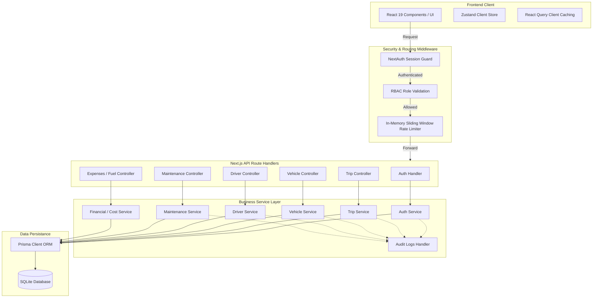
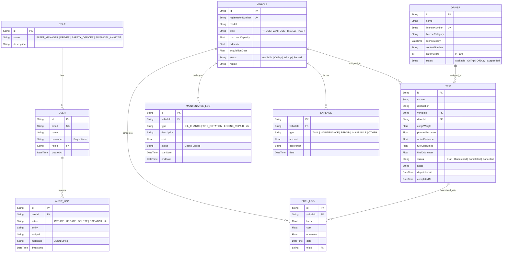
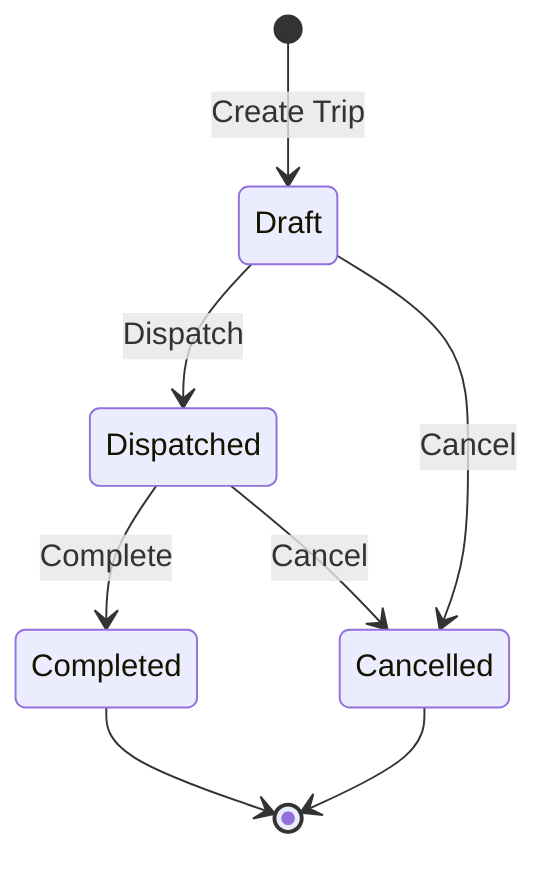

# 🚚 TransitOps — Smart Transport Operations Platform

TransitOps is an enterprise-grade, full-stack logistics and transport operations management platform. Built with **Next.js 16 (App Router)**, **TypeScript**, **Tailwind CSS**, and **Prisma ORM with SQLite**, it provides a real-time operational dashboard, role-based access control (RBAC), driver safety scoring, vehicle tracking, maintenance scheduling, trip routing, and financial expense analysis.

---

## 🏗️ System Architecture & Data Flow

TransitOps follows a clean, decoupled **Service-Layer Architecture** designed to separate API route orchestration from core business rules and transactional logic.



---

## 🗄️ Database & Entity-Relationship (ER) Diagram

The system maintains a highly normalized relational SQLite database via Prisma. Relationships and constraints enforce data consistency (e.g., preventing a driver or vehicle from being assigned to multiple active trips).



---

## 🔄 Trip Lifecycle & State Transitions

Trips transition through strict states using transactional queries (`$transaction`) in Prisma to prevent race conditions (e.g., assigning offline drivers or double-booking vehicles).



### Transition Operations & Business Logic

*   **Dispatch Action (`Draft` ➔ `Dispatched`)**:
    1. Validates that both the assigned Driver and Vehicle are currently `Available`.
    2. Updates the Driver's status to `OnTrip`.
    3. Updates the Vehicle's status to `OnTrip`.
*   **Complete Action (`Dispatched` ➔ `Completed`)**:
    1. Records actual distance traveled and fuel consumed.
    2. Updates the Vehicle's odometer reading.
    3. Automatically creates a `FuelLog` transaction (calculated at estimated cost).
    4. Resets both the Driver and Vehicle status back to `Available`.
*   **Cancel Action (`Draft` / `Dispatched` ➔ `Cancelled`)**:
    1. Resets both the Driver and Vehicle status back to `Available`.

---

## 🚀 Key Modules & Capabilities

- **📊 Operations Dashboard**: Visualizes real-time fleet KPIs (distance, fuel costs, active trips) alongside active status counters and a real-time Audit Log feed.
- **🚚 Fleet & Vehicle Inventory**: Tracks model details, odometer readings, and status transitions (`Available`, `OnTrip`, `InShop`, `Retired`).
- **👥 Operator Registry & Compliance**: Tracks licensing categories, active schedules, and real-time safety scores calculated from trip performance.
- **🔧 Maintenance logs & Workshops**: Tracks scheduled/emergency shop work (e.g., oil change, brake service, engine repair) and updates vehicle inventory statuses.
- **⛽ Fuel & Expense Tracking**: Logs refilling receipts and operations overhead costs (tolls, insurance, repairs).
- **🔒 Role-Based Access Control (RBAC)**: Protects views and actions strictly based on permissions:

| Module / Action | Fleet Manager | Driver | Safety Officer | Financial Analyst |
| :--- | :---: | :---: | :---: | :---: |
| **Manage Vehicles** | Write / Edit | Read Only | Read Only | Read Only |
| **Manage Drivers** | Write / Edit | Read Only | Write / Edit | Read Only |
| **Dispatch / End Trips** | Write / Edit | Write / Edit | No Access | No Access |
| **Close Maintenance** | Write / Edit | No Access | No Access | No Access |
| **Expenses & Fuel** | Write / Edit | No Access | No Access | Write / Edit |
| **View Audit Logs** | Read Only | No Access | Read Only | No Access |

---

## ⚙️ Getting Started & Setup Guide

### 1. Installation
Install the required package dependencies:
```bash
npm install
```

### 2. Environment Configuration
Create a `.env` file in the root directory:
```env
DATABASE_URL="file:./dev.db"
NEXTAUTH_SECRET="TransitOpsSecretKey2026ForHackathonDevelopmentOnly"
NEXTAUTH_URL="http://localhost:3000"
```

### 3. Database Initialization
Generate the Prisma client files and synchronize the relational schema mapping with the SQLite database:
```bash
npx prisma generate
npx prisma db push
```

### 4. Database Seeding
Populate the database with roles, users, and mock logistics records:
```bash
npm run db:seed
```

### 5. Start Development Server
Run the local next development environment:
```bash
npm run dev
```
Open **[http://localhost:3000](http://localhost:3000)** in your browser.

---

## 🔑 Demo Login Credentials
You can log in and test different user contexts using the following credentials:
* **Common Password for All Users:** `TransitOps@123`

| User Role | Assigned User | Login Email |
| :--- | :--- | :--- |
| **Fleet Manager** | Anurag Singh | `fleet@transitops.com` |
| **Driver** | Reeshav Raj | `driver@transitops.com` |
| **Safety Officer** | Rituraj Sharma | `safety@transitops.com` |
| **Financial Analyst** | Yashraj Kumar | `finance@transitops.com` |

---

## ❓ FAQ (Frequently Asked Questions)

#### Q: How is the rate limiter configured?
The rate limiter (`src/lib/rate-limit.ts`) uses an in-memory sliding window store. It allows up to 5 login attempts per minute for auth routes, and 30 mutations per minute for database endpoints to prevent API abuse.

#### Q: Why am I getting "Error code 14: Unable to open the database file"?
This error occurs if the database directory is missing or your `DATABASE_URL` is pointing to an invalid absolute directory path. Ensure your `.env` contains `DATABASE_URL="file:./dev.db"` which resolves relative to the `prisma/` folder structure.

#### Q: How do I reset the mock database data?
You can reset the database and seed it again fresh by running:
```bash
rm prisma/dev.db
npx prisma db push
npm run db:seed
```

---

## 👥 Credits & Development Team
* **Frontend Design & Engineering:** [Reeshav Raj](https://github.com/Reeshav12)
* **Backend Architecture & Core Services:** [Anurag Singh](https://github.com/Anurag-M1)
